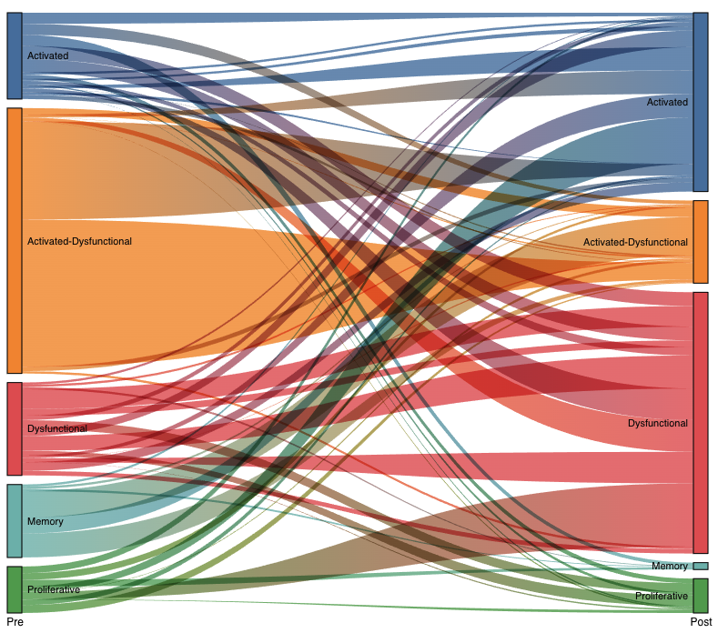

# Sankey

A Jinja template containing an interactive Sankey diagram that displays how phenotype distribution changes proportionally across two timepoints. An h5ad file is used to populate the template with data.

This was built using [Planetarium](https://github.com/shahcompbio/planetarium) and [Telescope](https://github.com/redpanda-cat/telescope)


## How to use

A python script (`sankey.py`) and dependencies list (`requirements.txt`) is provided. To use, call the script with the name of the dataset and path to the h5ad file. This should output a file named `sankey_<dataset ID>.html`

```
python sankey.py <dataset ID> <path/to/file.h5ad> 
```

You may specify these optional arguments:

```
-t / --threshold : Minimum number of cells present in a clone in each timepoint to be included. Default to 3.

-o / --order : Order of timepoint values - Must be two values. Defaults to values in timepoints column sorted alphanumerically.

--width : Pixel width of plot. Defaults to 800.

--height : Pixel height of plot. Defaults to 700.

--timepoint : Column name for timepoint in obs table. Defaults to "timepoint"

--clone : Column name for clone ID in obs table. Defaults to "clone_id"

--subtype : Column name for cell type in obs table. Defaults to "cell_type"

```


## Past Versions

### V1

- Links show clone flow

